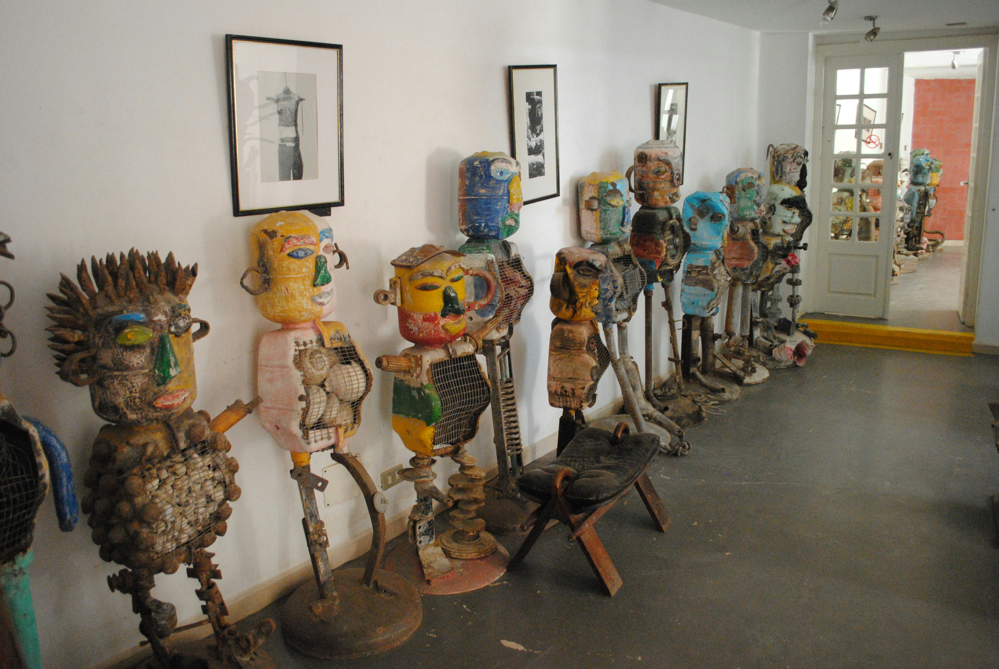
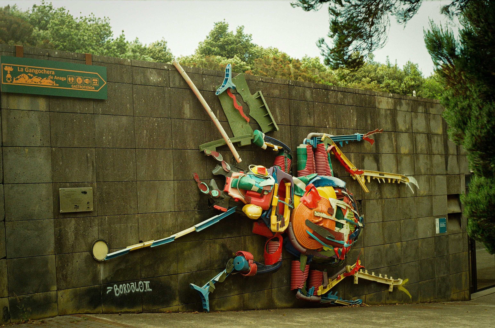

# Tutorial 1: Creación de la Estructura HTML

## Introducción

En este tutorial, aprenderás a crear la estructura básica de una página web utilizando **HTML**. Construiremos una página para un **Mapa de Iniciativas Ecológicas Locales**, que incluye un encabezado, un menú de navegación, un carrusel de imágenes, información sobre el proyecto, un formulario de registro y un mapa interactivo.

## Paso 1: Crear la Carpeta del Proyecto

1. **Crea una nueva carpeta** en tu computadora para organizar todos los archivos del proyecto. Puedes nombrarla `mapa_ecologico`.
2. Dentro de esta carpeta, almacenarás todos los archivos necesarios, como documentos HTML, hojas de estilo CSS, imágenes y más.

## Paso 2: Crear el Archivo HTML

1. **Abre tu editor de texto preferido** (por ejemplo, Visual Studio Code, Sublime Text, Notepad++).
2. **Crea un nuevo archivo** y guárdalo como `index.html` dentro de la carpeta `mapa_ecologico`.

## Paso 3: Estructura Básica del Documento HTML

Comienza con la estructura básica de un documento HTML5:

```html
<!DOCTYPE html>
<html lang="es">
<head>
    <meta charset="UTF-8">
    <title>Mapa de Iniciativas Ecológicas Locales</title>
</head>
<body>

</body>
</html>
```

- **`<!DOCTYPE html>`**: Indica que el documento utiliza la versión HTML5.
- **`<html lang="es">`**: Define el idioma del documento como español.
- **`<head>`**: Contiene información sobre el documento, como el título y metadatos.
- **`<body>`**: Contiene el contenido visible de la página web.

## Paso 4: Añadir Metadatos al `<head>`

Es importante incluir metaetiquetas en el `<head>` para especificar información adicional sobre la página.

Actualiza el `<head>` de la siguiente manera:

```html
<head>
    <meta charset="UTF-8">
    <meta name="viewport" content="width=device-width, initial-scale=1.0">
    <title>Mapa de Iniciativas Ecológicas Locales</title>
    <meta name="description" content="Una plataforma para identificar y promover iniciativas ecológicas locales.">
    <meta name="keywords" content="ecología, sostenibilidad, reciclaje, reforestación, medio ambiente">
    <meta name="author" content="Tu Nombre">
</head>
```

- **`<meta name="viewport" content="width=device-width, initial-scale=1.0">`**: Hace que el diseño sea responsivo en dispositivos móviles.
- **`<meta name="description">`**: Proporciona una breve descripción de la página.
- **`<meta name="keywords">`**: Lista de palabras clave relevantes para los motores de búsqueda.
- **`<meta name="author">`**: Indica el autor de la página.

## Paso 5: Añadir el Encabezado Principal

Dentro de `<body>`, agrega el encabezado principal:

```html
<!-- Encabezado Principal -->
<header>
    <h1>Mapa de Iniciativas Ecológicas Locales</h1>
</header>
```

- **`<header>`**: Representa el encabezado de la página.
- **`<h1>`**: Título principal del sitio web.

## Paso 6: Crear el Menú de Navegación

Añade un menú de navegación debajo del encabezado:

```html
<!-- Menú de Navegación -->
<nav>
    <ul>
        <li><a href="#inicio">Inicio</a></li>
        <li><a href="#registro">Registrar Iniciativa</a></li>
        <li><a href="#mapa">Mapa</a></li>
        <li><a href="#contacto">Contacto</a></li>
    </ul>
</nav>
```

- **`<nav>`**: Define una sección de navegación.
- **`<ul>`**: Lista no ordenada.
- **`<li>`**: Elemento de lista.
- **`<a href="#seccion">`**: Enlace que apunta a una sección específica de la página.

## Paso 7: Agregar el Carrusel de Imágenes

Incorpora una sección para el carrusel de imágenes:

```html
<!-- Carrusel de Imágenes -->
<section>
    <h2>Iniciativas Destacadas</h2>
    <div>
        <!-- Slides -->
        <div>
            
            <p>Descripción de la imagen 1</p>
        </div>
        <div>
            
            <p>Descripción de la imagen 2</p>
        </div>
        <div>
            
            <p>Descripción de la imagen 3</p>
        </div>
        <!-- Controles del carrusel -->
        <button>«</button>
        <button>»</button>
    </div>
</section>
```

- **`<section>`**: Define una sección en el documento.
- **`<div>`**: Contenedor genérico para agrupar elementos.
- **``**: Inserta una imagen.
- **`<p>`**: Párrafo para descripciones.
- **Botones "Anterior" y "Siguiente"**: Permitirá la navegación entre imágenes (funcionalidad añadida con JavaScript más adelante).

## Paso 8: Agregar el Contenido Principal

Incluye una sección informativa y el formulario de registro.

### Sección Informativa

```html
<!-- Contenido Principal -->
<main>
    <section>
        <h2>Sobre Nosotros</h2>
        <p>Esta plataforma tiene como objetivo identificar y promover iniciativas ecológicas en nuestra comunidad, como puntos de reciclaje, tiendas eco-friendly y zonas de reforestación.</p>
        <p>Únete a nosotros para crear un mundo más sostenible y conectado con el medio ambiente.</p>
    </section>
```

- **`<main>`**: Representa el contenido principal del documento.
- **`<h2>`**: Subtítulo de la sección.
- **`<p>`**: Párrafos de texto.

### Formulario de Registro

```html
    <section>
        <h2>Registrar Nueva Iniciativa</h2>
        <form action="#" method="post">
            <!-- Campos del formulario -->
            <label>Nombre de la Iniciativa:</label>
            <input type="text" required>

            <label>Descripción:</label>
            <textarea rows="4" required></textarea>

            <label>Categoría:</label>
            <select required>
                <option>Reciclaje</option>
                <option>Reforestación</option>
                <option>Tienda Eco-friendly</option>
                <option>Educación Ambiental</option>
                <option>Energía Renovable</option>
            </select>

            <label>Dirección:</label>
            <input type="text" required>

            <label>Ubicación (Latitud, Longitud):</label>
            <input type="text" placeholder="Ejemplo: -12.0464, -77.0428" required>

            <input type="submit" value="Registrar Iniciativa">
        </form>
    </section>
```

- **`<form>`**: Crea un formulario.
- **`<label>`**: Etiqueta para un campo del formulario.
- **`<input>`**, **`<textarea>`**, **`<select>`**: Elementos de entrada de datos.
- **Atributo `required`**: Indica que el campo es obligatorio.

## Paso 9: Añadir la Sección del Mapa

Incluye un mapa de Google Maps:

```html
    <section>
        <h2>Mapa de Iniciativas</h2>
        <div>
            <!-- Mapa interactivo -->
            <iframe src="https://www.google.com/maps/embed?pb=..." width="100%" height="500" allowfullscreen="" loading="lazy"></iframe>
        </div>
    </section>
</main>
```

- **`<iframe>`**: Inserta un marco que muestra el mapa.
- **Atributos del iframe**:
  - `src`: URL del mapa (debes reemplazar `...` con la URL real proporcionada por Google Maps).
  - `width` y `height`: Dimensiones del mapa.

## Paso 10: Añadir el Pie de Página

Finaliza el documento con un pie de página:

```html
<!-- Pie de Página -->
<footer>
    <p>&copy; 2023 Mapa de Iniciativas Ecológicas Locales</p>
</footer>
```

- **`<footer>`**: Representa el pie de página.
- **`&copy;`**: Símbolo de copyright.

## Paso 11: Guardar y Probar el Documento

1. **Guarda el archivo `index.html`**.
2. **Abre el archivo en un navegador web** (puedes hacer doble clic o clic derecho y seleccionar "Abrir con").
3. **Verifica** que el contenido se muestre correctamente.

¡Felicidades! Has creado la estructura HTML básica para tu proyecto.

---

# Tutorial 2: Estilización del Proyecto con CSS

## Introducción

En este tutorial, aprenderás a aplicar estilos **CSS** a tu página HTML para mejorar su apariencia visual. Introduciremos los selectores `class` e `id` a medida que avanzamos en la estilización, explicando detalladamente cómo funcionan y cómo afectan al diseño.

## Paso 1: Crear el Archivo CSS

1. **Crea un nuevo archivo** en tu editor de texto y guárdalo como `estilos.css` dentro de la carpeta `mapa_ecologico`.

## Paso 2: Enlazar el Archivo CSS al HTML

En el `<head>` de tu archivo `index.html`, añade el enlace al archivo CSS:

```html
<head>
    <!-- Metadatos -->
    <link rel="stylesheet" href="estilos.css">
</head>
```

- **`<link rel="stylesheet" href="estilos.css">`**: Enlaza la hoja de estilos CSS al documento HTML.

## Paso 3: Añadir la Fuente de Google Fonts

Incluye la fuente "Roboto" de Google Fonts:

1. **En tu navegador**, ve a [Google Fonts](https://fonts.google.com/) y busca la fuente "Roboto".
2. **Selecciona los estilos** que deseas usar (por ejemplo, Regular 400, Bold 700).
3. **Copia el enlace** proporcionado.

En tu `<head>`, añade:

```html
<head>
    <!-- Metadatos -->
    <link rel="stylesheet" href="estilos.css">
    <!-- Enlaces a Google Fonts -->
    <link rel="preconnect" href="https://fonts.googleapis.com">
    <link rel="preconnect" href="https://fonts.gstatic.com" crossorigin>
    <link href="https://fonts.googleapis.com/css2?family=Roboto&display=swap" rel="stylesheet">
</head>
```

- **`<link href="..." rel="stylesheet">`**: Enlaza la fuente "Roboto" al documento.

## Paso 4: Estilos Generales

En `estilos.css`, comienza estableciendo estilos generales para el cuerpo del documento:

```css
/* Estilos Generales */
body {
    font-family: 'Roboto', sans-serif;
    background-color: #E9EFEC; /* Color de fondo claro */
    margin: 0;
    padding: 0;
    color: #16423C; /* Color de texto principal */
}
```

- **`font-family`**: Aplica la fuente "Roboto" a todo el documento.
- **`background-color`**: Establece el color de fondo de la página.
- **`margin` y `padding`**: Eliminan los márgenes y padding predeterminados.
- **`color`**: Define el color del texto principal.

## Paso 5: Estilizar el Encabezado

### 5.1 Añadir un ID al Encabezado en el HTML

En `index.html`, agrega un atributo `id` al encabezado:

```html
<header id="encabezado">
    <h1>Mapa de Iniciativas Ecológicas Locales</h1>
</header>
```

- **`id="encabezado"`**: Asigna un identificador único al elemento.

### 5.2 Aplicar Estilos en CSS

En `estilos.css`, añade:

```css
/* Encabezado */
#encabezado {
    background-color: #16423C; /* Color primario oscuro */
    color: #E9EFEC; /* Texto claro */
    padding: 20px;
    text-align: center;
}

#encabezado h1 {
    margin: 0;
    font-size: 2.5em;
}
```

- **`#encabezado`**: Selector de ID que aplica estilos al elemento con `id="encabezado"`.
- **`background-color`** y **`color`**: Definen los colores de fondo y texto.
- **`padding`**: Añade espacio interno alrededor del contenido.
- **`text-align`**: Centra el texto horizontalmente.
- **`#encabezado h1`**: Aplica estilos al `<h1>` dentro del encabezado.

## Paso 6: Estilizar el Menú de Navegación

### 6.1 Añadir un ID al Menú en el HTML

En `index.html`, agrega:

```html
<nav id="navegacion">
    <ul>
        <!-- Enlaces -->
    </ul>
</nav>
```

### 6.2 Aplicar Estilos en CSS

En `estilos.css`:

```css
/* Menú de Navegación */
#navegacion {
    background-color: #6A9C89; /* Color secundario */
}

#navegacion ul {
    list-style: none; /* Quita los puntos de la lista */
    margin: 0;
    padding: 0;
    display: flex; /* Alinea los elementos horizontalmente */
    justify-content: center; /* Centra los elementos */
}

#navegacion li {
    margin: 0;
}

#navegacion a {
    display: block;
    color: #E9EFEC; /* Texto claro */
    padding: 15px 20px;
    text-decoration: none;
    font-weight: bold;
}

#navegacion a:hover {
    background-color: #16423C; /* Cambia el fondo al pasar el cursor */
}
```

- **`display: flex`**: Utilizamos Flexbox para alinear los elementos horizontalmente.
- **`justify-content: center`**: Centra los elementos dentro del contenedor.
- **`list-style: none`**: Elimina los puntos de la lista.
- **`text-decoration: none`**: Quita el subrayado de los enlaces.
- **`font-weight: bold`**: Hace que el texto sea negrita.
- **Pseudo-clase `:hover`**: Cambia el estilo de los enlaces cuando el usuario pasa el cursor sobre ellos.

## Paso 7: Estilizar el Carrusel de Imágenes

### 7.1 Añadir un ID y Clases en el HTML

En `index.html`, actualiza el carrusel:

```html
<section id="carrusel">
    <h2>Iniciativas Destacadas</h2>
    <div class="carrusel-contenedor">
        <!-- Slides -->
        <div class="slide">
            
            <p>Descripción de la imagen 1</p>
        </div>
        <!-- Más slides... -->
        <!-- Controles del carrusel -->
        <button class="prev">«</button>
        <button class="next">»</button>
    </div>
</section>
```

- **`id="carrusel"`**: Identifica la sección del carrusel.
- **`class="carrusel-contenedor"`**: Clase para el contenedor del carrusel.
- **`class="slide"`**: Clase para cada slide.
- **`class="prev"`**, **`class="next"`**: Clases para los botones de navegación.

### 7.2 Aplicar Estilos en CSS

En `estilos.css`:

```css
/* Carrusel */
#carrusel {
    text-align: center;
    padding: 20px 10px;
    background-color: #C4DAD2; /* Color de acento */
}

.carrusel-contenedor {
    position: relative;
    max-width: 1000px;
    margin: auto;
    overflow: hidden;
    border-radius: 5px;
}

.slide {
    display: none; /* Oculta los slides por defecto */
}

.slide img {
    width: 100%;
    height: auto;
    border-radius: 5px;
}

.slide:first-child {
    display: block; /* Muestra el primer slide */
}

/* Botones de navegación */
.prev, .next {
    background-color: rgba(22, 66, 60, 0.7); /* Color semitransparente */
    border: none;
    color: #E9EFEC;
    padding: 5px 12px;
    position: absolute;
    top: 50%;
    cursor: pointer;
    border-radius: 50%;
    font-size: 1.5em;
    transform: translateY(-50%); /* Centra verticalmente */
}

.prev {
    left: 15px;
}

.next {
    right: 15px;
}

.prev:hover, .next:hover {
    background-color: rgba(22, 66, 60, 0.9);
}
```

- **`.slide`**: Oculta todos los slides inicialmente.
- **`.slide:first-child`**: Muestra el primer slide.
- **`position: absolute`**: Ubica los botones sobre las imágenes.
- **`transform: translateY(-50%)`**: Centra verticalmente los botones.
- **`border-radius`**: Redondea las esquinas de las imágenes y botones.
- **Uso de `rgba`**: Crea colores con transparencia.

## Paso 8: Estilizar el Contenido Principal

### Sección Informativa

#### 8.1 Añadir un ID en el HTML

En `index.html`:

```html
<section id="informacion">
    <h2>Sobre Nosotros</h2>
    <!-- Contenido -->
</section>
```

#### 8.2 Aplicar Estilos en CSS

En `estilos.css`:

```css
/* Contenido Principal */
main {
    padding: 40px 20px;
}

section {
    margin-bottom: 60px;
}

/* Sección Informativa */
#informacion h2 {
    color: #16423C;
    text-align: center;
}

#informacion p {
    line-height: 1.8; /* Espacio entre líneas */
    max-width: 800px; /* Ancho máximo para mejorar la legibilidad */
    margin: 20px auto; /* Centra el texto */
    text-align: center;
}
```

- **`line-height`**: Aumenta el espacio entre líneas para facilitar la lectura.
- **`max-width`** y **`margin: auto`**: Controlan el ancho y centran el contenido.

### Formulario de Registro

#### 8.3 Añadir un ID en el HTML

En `index.html`:

```html
<section id="registro">
    <h2>Registrar Nueva Iniciativa</h2>
    <!-- Formulario -->
</section>
```

#### 8.4 Aplicar Estilos en CSS

En `estilos.css`:

```css
/* Formulario de Registro */
#registro h2 {
    text-align: center;
    color: #16423C;
}

#registro form {
    max-width: 600px;
    margin: auto;
    background-color: #FFFFFF;
    padding: 30px;
    border-radius: 10px;
    box-shadow: 0 4px 6px rgba(0, 0, 0, 0.1);
}

#registro label {
    display: block;
    margin-top: 15px;
    color: #16423C;
    font-weight: bold;
}

#registro input[type="text"],
#registro textarea,
#registro select {
    width: 100%;
    padding: 10px;
    box-sizing: border-box;
    border: 1px solid #C4DAD2;
    border-radius: 5px;
    background-color: #E9EFEC;
}

#registro input[type="text"]:focus,
#registro textarea:focus,
#registro select:focus {
    border-color: #6A9C89;
    outline: none;
}

#registro input[type="submit"] {
    margin-top: 20px;
    background-color: #6A9C89;
    color: #E9EFEC;
    border: none;
    padding: 15px;
    cursor: pointer;
    width: 100%;
    font-size: 1.1em;
    border-radius: 5px;
}

#registro input[type="submit"]:hover {
    background-color: #16423C;
}
```

- **Estilos del formulario**: Creamos un fondo blanco con sombra y bordes redondeados.
- **Campos de entrada**: Estilizamos los campos para que sean atractivos y fáciles de usar.
- **Pseudo-clase `:focus`**: Cambia el estilo de los campos cuando el usuario hace clic en ellos.
- **Botón de envío**: Destaca y cambia de color al pasar el cursor.

## Paso 9: Estilizar la Sección del Mapa

### 9.1 Añadir un ID en el HTML

En `index.html`:

```html
<section id="mapa">
    <h2>Mapa de Iniciativas</h2>
    <div>
        <!-- Mapa -->
    </div>
</section>
```

### 9.2 Aplicar Estilos en CSS

En `estilos.css`:

```css
/* Sección del Mapa */
#mapa {
    padding: 40px 20px;
    background-color: #C4DAD2;
    border-radius: 10px;
}

#mapa h2 {
    text-align: center;
    color: #16423C;
}

#mapa div {
    height: 500px;
}
```

- **Estilos coherentes** con el resto de la página.
- **`height`**: Define la altura del contenedor del mapa.

## Paso 10: Estilizar el Pie de Página

### 10.1 Añadir un ID en el HTML

En `index.html`:

```html
<footer id="pie-de-pagina">
    <p>&copy; 2023 Mapa de Iniciativas Ecológicas Locales</p>
</footer>
```

### 10.2 Aplicar Estilos en CSS

En `estilos.css`:

```css
/* Pie de Página */
#pie-de-pagina {
    background-color: #16423C;
    color: #E9EFEC;
    text-align: center;
    padding: 15px;
}

#pie-de-pagina p {
    margin: 0;
    font-size: 0.9em;
}
```

- **Crea un pie de página atractivo** y consistente con el diseño general.

## Paso 11: Añadir Responsividad

En `estilos.css`, añade:

```css
/* Diseño Responsivo */
@media screen and (max-width: 768px) {
    #navegacion ul {
        flex-direction: column; /* Cambia el menú a vertical */
    }

    .prev, .next {
        padding: 3px 8px;
    }

    #registro form {
        width: 100%;
        padding: 20px;
    }

    #encabezado h1 {
        font-size: 2em;
    }
}
```

- **Media Query**: Aplica estilos cuando el ancho de pantalla es menor o igual a 768px.
- **Ajustes para dispositivos móviles**: Mejora la usabilidad en pantallas pequeñas.

## Paso 12: Guardar y Probar los Estilos

1. **Guarda el archivo `estilos.css`**.
2. **Actualiza el navegador** donde tienes abierto `index.html` para ver los cambios.
3. **Verifica** que los estilos se apliquen correctamente y que el diseño se vea moderno y atractivo.

---

¡Felicidades! Has completado la estilización de tu página web, aprendiendo a utilizar selectores de `class` e `id`, y comprendiendo cómo afectan al diseño. Ahora tienes una página web funcional y estéticamente agradable.

---

## Recursos Adicionales

- **[W3Schools HTML Tutorial](https://www.w3schools.com/html/)**: Para profundizar en HTML.
- **[W3Schools CSS Tutorial](https://www.w3schools.com/css/)**: Para aprender más sobre CSS.
- **[MDN Web Docs](https://developer.mozilla.org/es/docs/Web)**: Documentación detallada sobre tecnologías web.

Continúa practicando y explorando más opciones de diseño y funcionalidad. ¡El desarrollo web es un camino emocionante lleno de posibilidades!